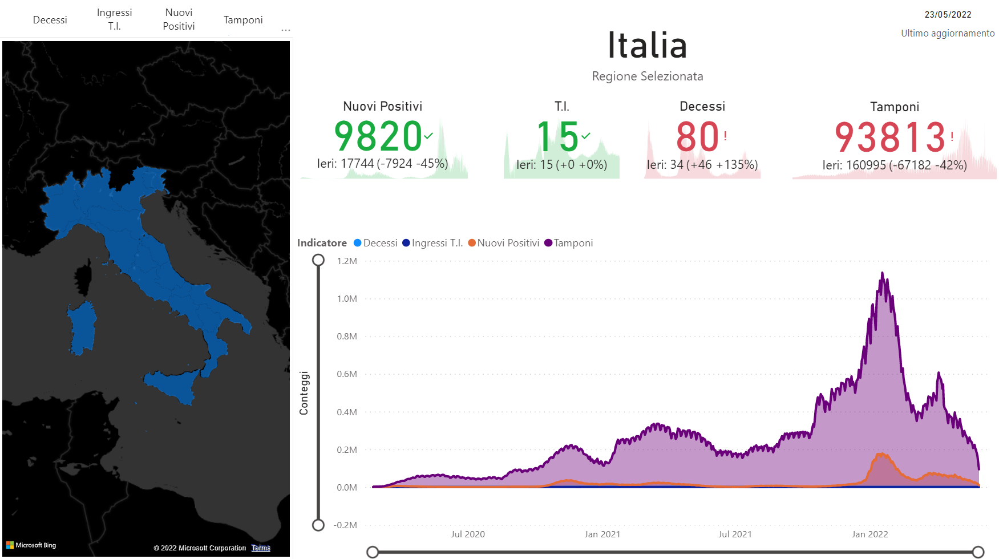
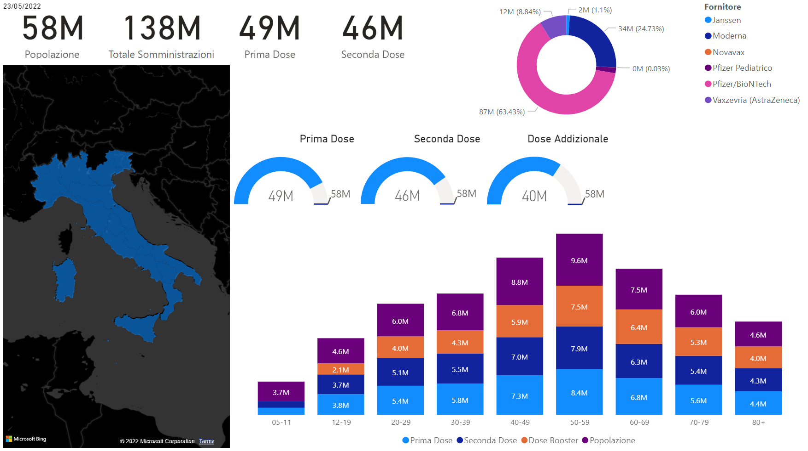
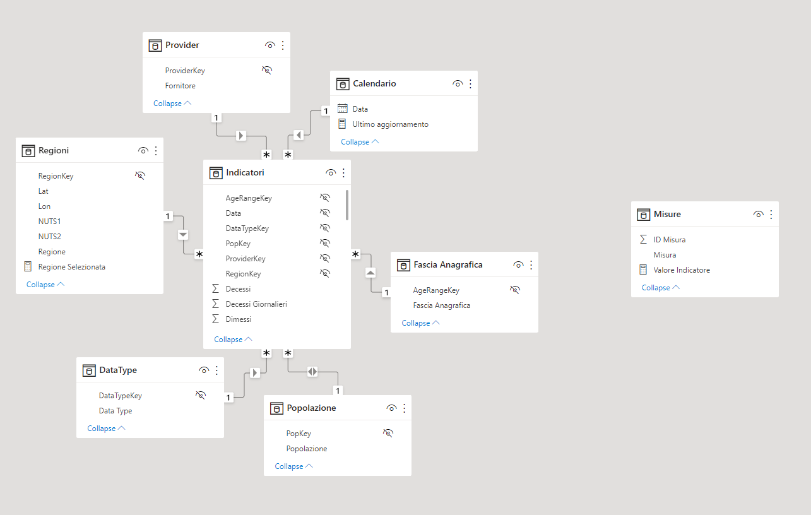

# covid-etl-df
The scope of this project is the creation of insightful
analytics on the Italian COVID pandemic and vaccine status.

## Description
This repository hosts an Azure Data Factory (ADF) to perform the ingestion of the
official COVID-19 pandemic- and vaccine-data on an Azure SQL Database.
It also contains for the DDL needed for the creation of the data model
on an Azure SQL Database.

## Data Factory
The ADF consists of:
* 1 tumbling-window trigger
* 3 linked services
* 3 datasets
* 5 ingestion pipelines

### The Trigger
The tumbling-window trigger is set to play every 24 hours, and it triggers the ingestion

### The linked services
#### Azure SQL Database
The SQL Server database the data is copied to
#### DPC Github
The HTTP request that is sent to the civil protection Github repository [PCM-DPC](https://github.com/pcm-dpc/COVID-19)
to retrieve the pandemic data
#### Italia OD Github
The HTTP request that is sent to the [Italia-OpenData](https://github.com/italia/covid19-opendata-vaccini)
repository to retrieve the pandemic data

### The datasets
#### GithubDPC
Represents the CSV file from the civil-protection repository taken from its linked service
#### GithubOD
Represents the CSV file from the Italia open data repository taken from its linked service
#### SQLDB
Represents the dataset needed for the copy to the Azure SQL DB linked service

### Pipelines
The main pipeline is the `Data Ingestion` pipeline.
This calls two pipelines:
* `Ingest Pandemic Data`
* `Ingest Vax Data`

which in turn call the two parametric copy-activity pipelines:
* `OD 2 SQL`
* `PCM-DPC 2 SQL`

These are parametric in directory name and file name to be retrieved from the relevant
Github repositories and perform the copy activities from the CSV files to
the relevant tables on SQL, together with a provided stored procedure
that update the age ranges in the
[Italia-Open-Data adminstrations CSV file](https://github.com/italia/covid19-opendata-vaccini/blob/master/dati/somministrazioni-vaccini-latest.csv)
to harmonize the age-range with their provided [population CSV file](https://github.com/italia/covid19-opendata-vaccini/blob/master/dati/platea.csv)

## The DDL scripts
The needed tables, view, and procedure are defined under `SQL/`.
The scripts create the relevant tables needed for the ingestion;
an update procedure to harmonize the data; the views to be exposed to
the data model.

## Usage
The repository does not contain any script for the automated deployment of the ADF.
However, in order to deploy the ADF, apart from clicking on the button at the top of this repo
it is needed to:
* fork this repo
* provision an Azure SQL Database (connection string needed in the template)
* provision an Azure Data Factory

Once the services have been created, run:
* table creation in `SQL/tables.sql`
* procedure creation in `SQL/procedures.sql`
* views creation in `SQL\views.sql`

At this stage all the components needed to create the data model are in place.
The screenshot below shows the designed data model

and the relevant PowerBI report, whose screenshot is at the top of this README,
can be found inside `SampleReport/COVID.pbix`

## Donation
If you liked this project or if I saved you some time, feel free to buy me a beer
:beer: Cheers!

